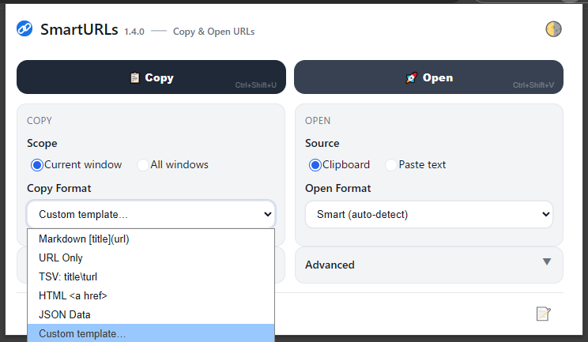
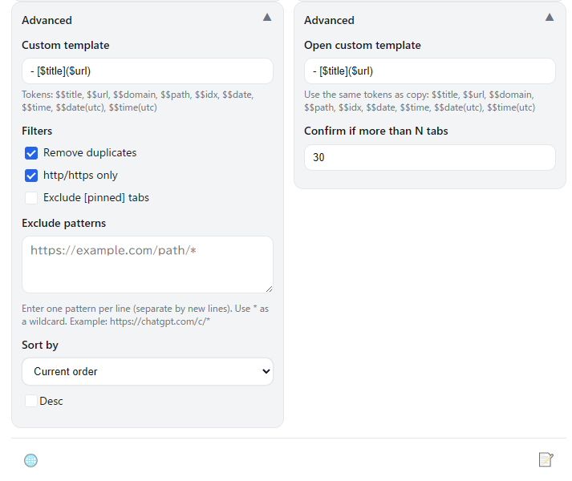
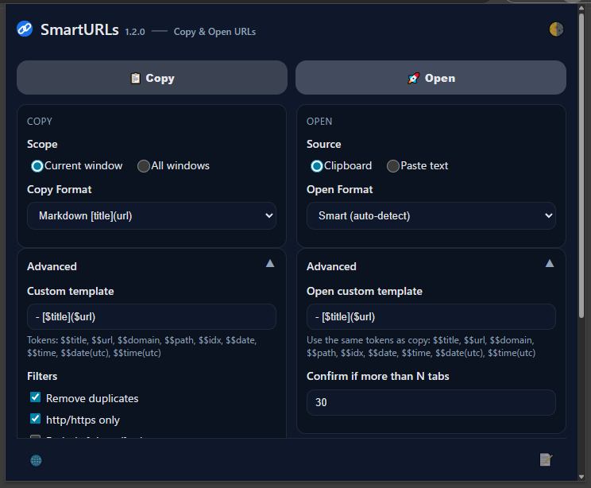

# SmartURLs

SmartURLs is a Chrome extension that helps you **copy**, **manage**, and **open** URLs easily and flexibly.
Copy all tab URLs in multiple formats, or open URLs directly from text or your clipboard — all in one click.

[](https://chrome.google.com/webstore/detail/smarturls/your-extension-id)
[](LICENSE)

---

## Screenshots



| Advanced Options | Dark Theme |
|:----------------:|:-----------:|
|  |  |

---

## ✨ Features

### 📋 Copy URLs

* Export tab URLs as **Markdown**, **HTML**, **TSV**, **JSON**, or **custom templates**
* Include **page titles** for better readability
* Choose scope: **current window** or **all windows**
* Filter options: remove duplicates, protocol restrictions, skip pinned tabs
* Exclude URLs using **wildcard patterns**
* **Protocol allowlist**: Control which URL schemes to include (https, http, file, etc.)

### 🚀 Open URLs

* Detect and open URLs from **clipboard** or **pasted text**
* Supports various formats (Markdown, HTML, JSON, TSV, plain text, etc.)
* Automatically detects text format
* Optional confirmation before opening many tabs
* **Protocol restrictions**: Safety-first filtering for opened URLs
* Status feedback distinguishes skipped vs. failed URLs with protocol names

### ⌨️ Keyboard Shortcuts

* **System-wide shortcuts** that work even when the popup is closed
* **Copy URLs** from tabs with a single keystroke (default: Ctrl+Shift+U / Cmd+Shift+U on Mac)
* **Open URLs** from clipboard with a single keystroke (default: Ctrl+Shift+V / Cmd+Shift+V on Mac)
* Configure custom shortcuts via `chrome://extensions/shortcuts`
* Shortcuts displayed in popup for easy reference

### 🎨 Appearance & Settings

* **Themes:** System / Dark / Light
* **Languages:** 16 supported, switch instantly
* **Preferences:** Saved automatically via Chrome Storage
* Clean, lightweight, and responsive popup design

---

## 📘 Documentation - Custom Template System

SmartURLs has full multi-language documentation for the Custom Template System (v1.4.0+).

- 🌐 **Documentation Home**  
  <https://isshiki.github.io/SmartURLs/>

- 🇺🇸 **English: Custom Template Guide**  
  <https://isshiki.github.io/SmartURLs/custom-templates.en>

- 🌏 Documentation available in 16 languages (Japanese, Spanish, German, Korean, Chinese, and more)

---

## 📦 Installation

### From Chrome Web Store

1. Visit the [SmartURLs page](https://chromewebstore.google.com/detail/smarturls-copy-and-open-u/ekeecbnnlnmjimahpjnfdognobmabbfb)  on the Chrome Web Store
2. Click **Add to Chrome**

### Manual (Development)

1. Clone or download this repository
2. Open `chrome://extensions` in Chrome
3. Enable **Developer mode**
4. Click **Load unpacked** and select the `smarturls` folder

---

## 🗒 Version History

| Version | Date       | Notes                  |
| ------- | ---------- | ---------------------- |
| 1.5.1   | 2025-12-22 | Shortcut open confirmations via notifications |
| 1.5.0   | 2025-12-19 | Protocol restrictions for copy/open with detailed status feedback |
| 1.4.0   | 2025-12-11 | Custom Template System enhancements |
| 1.3.0   | 2025-12-05 | Added keyboard shortcut support |
| 1.2.0   | 2025-10-30 | UI improvements |
| 1.1.0   | 2025-10-26 | UI improvements and security enhancements |
| 1.0.1   | 2025-10-26 | Fixed \$date(utc) and \$time(utc) template tokens |
| 1.0.0   | 2025-10-26 | Initial public release |

---

## ❓ FAQ

### Linux Notification Behavior

**Q: Why do I see a notification popup when using keyboard shortcuts on Linux?**

When you use keyboard shortcuts (Ctrl+Shift+U or Ctrl+Shift+V) on Linux, you may see a small notification popup appear. This is normal behavior and not a bug.

**Why this happens:**

- Linux desktop environments (GNOME, KDE, Xfce, etc.) control how Chrome extension notifications are displayed
- SmartURLs uses notifications to confirm that actions completed successfully
- The extension itself cannot control whether or how the notification popup appears — this is determined by your Linux system

**To disable notification popups:**

If you prefer not to see these popups, you can disable Chrome notifications in your Linux system settings:

- **GNOME:** Settings → Notifications → Google Chrome (toggle off)
- **KDE:** System Settings → Notifications → Applications → Google Chrome (configure or disable)
- **Xfce:** Settings → Notifications → Applications (configure Chrome)

The keyboard shortcuts will continue to work normally even with notifications disabled.

---

## 🛠️ Development

### Project Structure

```text
smarturls/
├── manifest.json              # Extension core config
│
├── popup.html                 # UI: popup window
├── popup.js
├── styles.css
│
├── actions.js                 # Shared logic (copy/open logic)
├── sw.js                      # Service worker (background logic)
├── offscreen.html             # Clipboard bridge
├── offscreen.js
│
├── _locales/                  # Internationalization
│   ├── en/
│   ├── ja/
│   └── … (14 more)
│
├── icons/                     # App icons
│
├── build.ps1                  # Build scripts
├── build.bat
│
└── README.md
```

### ⛏️ Testing the Extension

SmartURLs can be tested locally before publishing to the Chrome Web Store.

#### During Development

1. Open `chrome://extensions`
2. Enable **Developer mode**
3. Click **Load unpacked** and select the project folder (`smarturls/`)
4. Make code changes and reload the extension with the **⟳ Reload** button

#### Before Publishing

1. Run the build script:

   ```powershell
   .\build.ps1
   ```

   → This generates a ZIP file in `/dist/`

2. In `chrome://extensions`, **remove** the unpacked version (to avoid conflicts)

3. In `chrome://extensions`, **drag and drop** the generated ZIP file onto the page to test it directly

4. Verify that it installs and works correctly before uploading to the Chrome Web Store

🗒 **Tip:**
Always test the ZIP version before submitting — this ensures that `manifest.json` and folder paths are correctly packaged.

### 📤 To Publish

If you plan to publish or update the extension:

1. Go to the [Chrome Web Store Developer Console](https://chrome.google.com/webstore/devconsole/)
2. Upload your `.zip` package built from the project folder
3. Fill out the metadata (name, description, screenshots, etc.)
4. Submit for review

🗒 **Tip:**
Use the same version number as in `manifest.json` before uploading.

---

## ⚖️ License

Licensed under the [Apache License 2.0](LICENSE).

---

## 💬 Feedback

* Report bugs or suggestions via [GitHub Issues](https://github.com/isshiki/SmartURLs/issues)
* Pull requests are always welcome
