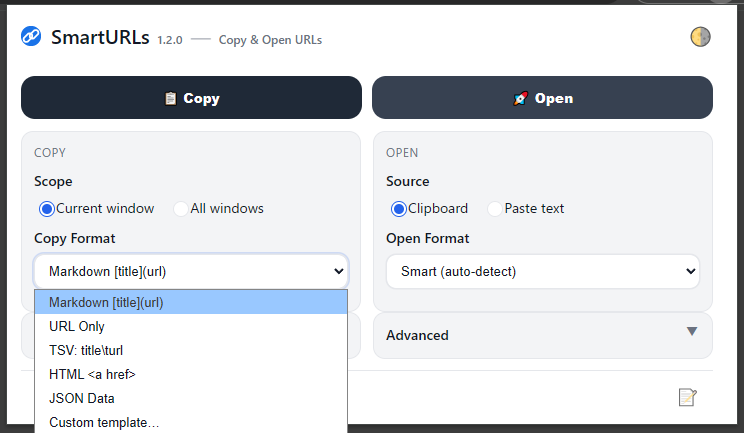

# SmartURLs

SmartURLs is a Chrome extension that helps you **copy**, **manage**, and **open** URLs easily and flexibly.
Copy all tab URLs in multiple formats, or open URLs directly from text or your clipboard — all in one click.

[](https://chrome.google.com/webstore/detail/smarturls/your-extension-id)
[](LICENSE)

---



---

## ✨ Features

### 📋 Copy URLs

* Export tab URLs as **Markdown**, **HTML**, **TSV**, **JSON**, or **custom templates**
* Include **page titles** for better readability
* Choose scope: **current window** or **all windows**
* Filter options: remove duplicates, HTTP/HTTPS only, skip pinned tabs
* Exclude URLs using **wildcard patterns**

### 🚀 Open URLs

* Detect and open URLs from **clipboard** or **pasted text**
* Supports various formats (Markdown, HTML, JSON, TSV, plain text, etc.)
* Automatically detects text format
* Optional confirmation before opening many tabs

### 🎨 Appearance & Settings

* **Themes:** System / Dark / Light
* **Languages:** 16 supported, switch instantly
* **Preferences:** Saved automatically via Chrome Storage
* Clean, lightweight, and responsive popup design

---

## 📦 Installation

### From Chrome Web Store

1. Visit the [SmartURLs listing](https://chrome.google.com/webstore/detail/smarturls/your-extension-id)
2. Click **Add to Chrome**

### Manual (Development)

1. Clone or download this repository
2. Open `chrome://extensions` in Chrome
3. Enable **Developer mode**
4. Click **Load unpacked** and select the `smarturls` folder

---

## 🗒 Version History

| Version | Date       | Notes                  |
| ------- | ---------- | ---------------------- |
| 1.0.0   | 2025-10-26 | Initial public release |

---

## 🛠️ Development

### Project Structure

```text
smarturls/
├── manifest.json
├── popup.html
├── popup.js
├── styles.css
├── sw.js
├── build.ps1
├── build.bat
├── _locales/
│   ├── en/
│   ├── ja/
│   └── ... (14 more)
├── icons/
└── README.md
```

### ⛏️ Testing the Extension

SmartURLs can be tested locally before publishing to the Chrome Web Store.

#### During Development

1. Open `chrome://extensions`
2. Enable **Developer mode**
3. Click **Load unpacked** and select the project folder (`smarturls/`)
4. Make code changes and reload the extension with the **⟳ Reload** button

#### Before Publishing

1. Run the build script:

   ```powershell
   .\build.ps1
   ```

   → This generates a ZIP file in `/dist/`

2. In `chrome://extensions`, **remove** the unpacked version (to avoid conflicts)

3. In `chrome://extensions`, **drag and drop** the generated ZIP file onto the page to test it directly

4. Verify that it installs and works correctly before uploading to the Chrome Web Store

🗒 **Tip:**
Always test the ZIP version before submitting — this ensures that `manifest.json` and folder paths are correctly packaged.

---

## ⚖️ License

Licensed under the [Apache License 2.0](LICENSE).

---

## 💬 Feedback

* Report bugs or suggestions via [GitHub Issues](https://github.com/isshiki/smarturls/issues)
* Pull requests are always welcome
